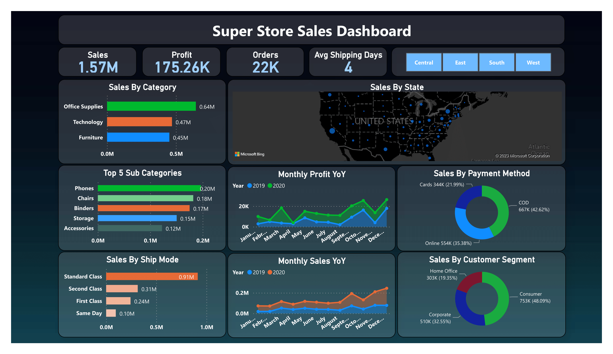
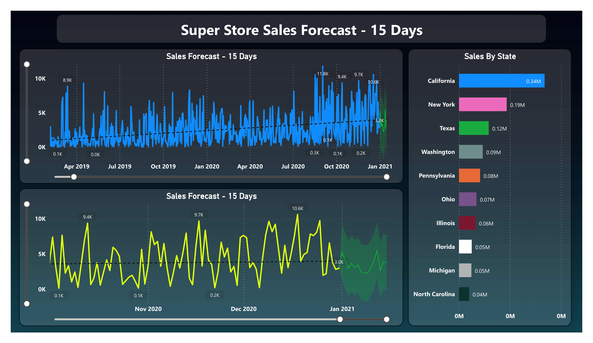

# SuperStore-Sales-Dashboard-On-PowerBI
***"SuperStore Sales PowerBI Dashboard" is a dynamic visualization tool providing insights into sales performance, enabling data-driven decision-making.***

## Author
- [@saadharoon27](https://github.com/saadharoon27)

## Table of Contents
- [Project Objectives](#project-Objectives)
- [Data Source](#data-source)
- [Column Overview](#column-overview)
- [Quick Glance At The Dashboard](#quick-glance-at-the-dashboard)
- [Method](#method)
- [Selection Of KPIs](#selection-of-kpis)
- [Selection of Charts and Visualisation Options](#selection-of-charts-and-visualisation-options)
- [Steps in Data Cleaning](#steps-in-data-cleaning)
- [Data Filters (Slicer)](#data-filters-(slicer))
- [Sales Forecasting Dashboard](#sales-forecasting-dashboard)
- [Business Insights](#business-insights)

## Project Objectives
- 1. **Identify Profitable Categories and Sub-Categories:**
   - Determine which product categories and sub-categories drive the highest *revenue* and *profits*.
   - Suggest strategies to further capitalize on these segments.

- 2. **Optimize Shipping Methods:**
   - Evaluate the effectiveness of different *shipping methods* in terms of *revenue generation*.
   - Recommend improvements or changes to *shipping strategies*.

- 3. **Year-on-Year Analysis:**
   - Analyze *year-on-year sales* and *profit trends* to understand *growth patterns*.
   - Identify factors contributing to *revenue* and *profit changes*.

- 4. **Geographical Insights:**
   - Gain insights into *sales performance* across different *states*.
   - Identify *high-revenue states* and *potential growth areas*.

- 5. **Customer Segment Strategies:**
   - Understand the role of different *customer segments* in *sales*.
   - Develop targeted strategies to cater to the most *profitable segments*.

- 6. **Payment Method Optimization:**
   - Determine the *popularity of payment methods* among customers.
   - Suggest incentives or improvements to encourage *preferred payment methods*.

## Data Source
- [SuperStore Dataset](https://www.kaggle.com/datasets/saadharoon27/superstore-dataset)

## Column Overview

| **Column Name**  | **Description**                                              |
|------------------|--------------------------------------------------------------|
| **Row ID**       | An identifier for each row of data.                          |
| **Order ID**     | A unique identifier for each order made.                     |
| **Order Date**   | The date when the order was placed.                          |
| **Ship Date**    | The date when the order was shipped.                         |
| **Ship Mode**    | The mode of shipping for the order.                          |
| **Customer ID**  | A unique identifier for each customer.                       |
| **Customer Name**| The name of the customer who placed the order.              |
| **Segment**      | The customer segment to which the customer belongs.          |
| **Country**      | The country where the order was placed.                     |
| **City**         | The city where the order was placed.                        |
| **State**        | The state where the order was placed.                       |
| **Region**       | The region where the order was placed.                      |
| **Product ID**   | A unique identifier for each product.                        |
| **Category**     | The category to which the product belongs.                  |
| **Sub-Category** | A more specific sub-category within the product category.    |
| **Product Name** | The name of the product.                                     |
| **Sales**        | The total sales amount for the order.                       |
| **Quantity**     | The quantity of the product ordered.                         |
| **Profit**       | The profit earned from the order.                            |
| **Returns**      | Information about returns (if any).                          |
| **Payment Mode** | The mode of payment used for the order.                      |
| **ind1**         | (Empty column)                                              |
| **ind2**         | (Empty column)                                              |
----------------------------------------------------------------------------------

## Quick Glance At The Dashboard
**Basic Dashboard**

------------------------------------
**Forecasting Dashboard**

## Method
- Exploratory data analysis _(EDA)_

## Selection Of KPIs
- **Sales:** This metric sums up all sales transactions' values, providing an overview of the *revenue* generated by the store.
- **Profit:** This metric combines *revenue* and *costs* to show the net *profit* earned by the store.
- **Quantity:** This metric adds up all *units* or *items* sold, giving insights into *customer demand*.
- **Avg Shipping Days:** The average number of days it takes for the order to get *shipping*.

## Selection of Charts and Visualisation Options
- 1. **Sales By Category – Clustered Bar Chart:** Chose a *stacked column chart* to display "Sales By Category." In this chart, the categories' revenue is depicted along the X-axis, while the columns represent the respective categories on the Y-axis. This visualization helps illustrate how each category contributes to the overall *revenue*.

- 2. **Top 5 Sub Categories – Clustered Bar Chart:** In this chart, substituted the category values on the y-axis with *sub-category values*. Additionally, applied a filter to showcase the *top 5 sub-categories* that have contributed the most *revenue* to the company. This adjustment allows for a more detailed examination of the most profitable *product segments*.

- 3. **Sales By Ship Mode – Clustered Bar Chart:** The chart displays revenue generated by various *shipping methods*. To identify the shipping method that contributed the most *revenue* for the firm, look for the highest bar on the chart. Conversely, to determine the shipping method with the lowest *revenue contribution*, locate the lowest bar on the chart.

- 4. **Monthly Sales YoY – Area Chart:** The *area chart* displays the firm's *monthly revenue*, and it was chosen to facilitate a *year-on-year comparison* between 2019 and 2020. This chart enables a straightforward side-by-side assessment of *sales* between the two years. Notably, in 2020, the firm's *revenue* more than doubled, indicating *substantial growth*.

- 5. **Monthly Profit YoY – Area Chart:** A same approach was taken with the *Monthly Profit Year-over-Year (YoY) chart* for the same underlying reason.

- 6. **Sales by State – Map Chart:** The most effective way to display the total *sales* made by different *states* is through a *bubble chart*. In this chart, the size of each bubble corresponds to both the *revenue* from sales and the *profit* generated by each state. Larger bubbles indicate higher *revenue* for that particular state, providing a clear and visually informative representation of the data.

- 7. **Sales by Customer Segment – Donut Chart:** This chart illustrates the contribution of each *customer segment* to the total *sales*, revealing that the *Consumer Segment* is responsible for the largest share at *48.09%* of the total *sales*.

- 8. **Sales by Payment Mode – Donut Chart:** Various *payment methods* and the percentage of the total transaction value associated with each of them.
 
## Steps in Data Cleaning

1. **After loading the data**, clicked on "transform data" to start the data cleaning process. During this stage, examined all the columns to determine their data types and checked for any missing values. While doing this, noticed that two columns, namely '**ind1**' and '**ind2**,' had no data at all, with 100% of their values being empty. As a result, **decided to remove** these two columns from the dataset to streamline it for further analysis.

2. The '**Returns**' column in the dataset originally had two values: '**#N/A**' indicating the customer did not return the product and '**1**' indicating a returned product. To enhance data clarity and avoid potential visualization issues, all instances of '**#N/A**' were **replaced with '0'**, signifying that the customer did not return the product.

3. **Added a new column** in the table view called '**AvgDelivery**.' This column calculates the number of days it took for orders to be shipped using the DAX function, `AvgDelivery = DATEDIFF('SuperStore_Sales_Dataset'[Order Date], 'SuperStore_Sales_Dataset'[Ship Date], DAY)`.

4. For forecasting, **created a new table** called '**SalesForecast**' using DAX function `SalesForecast = SUMMARIZE('SuperStore_Sales_Dataset', SuperStore_Sales_Dataset[Order Date], "Total Dates", SUM(SuperStore_Sales_Dataset[Sales]))`. This table aggregates the number of orders for each date, enabling the plotting of daily order trends, which is essential for predicting future sales patterns.

## Data Filters (Slicer)
- **Region Slicer:** To enhance data analysis and gain deeper insights, a *region slicer* has been introduced. This slicer enables users to focus specifically on the four major regions of the United States: *Central*, *East*, *South*, and *West*. This segmentation allows for a more detailed examination of data patterns and trends within these distinct geographical areas.

## Sales Forecasting Dashboard
- **To forecast**, made a new sheet called '**Forecasting**' and opted for a *line chart* visualization. This choice was made because forecasting typically necessitates a *time series representation*. Positioned '**Order Date**' on the X-axis (Filter: *Day*). For the Y-axis, employed the *summation of sales*, as forecasting is contingent on *historical sales data*.

- In the forecasting setup, determined a forecast length of *15 days* and applied a *95% confidence interval*. These parameters help in generating predictions with a certain level of accuracy and within a defined time frame, assisting in *future planning* and *decision-making*.

## Business Insights
- 1. **In both October of 2019 and 2020**, there was a noticeable drop in the number of sales, but an interesting phenomenon was observed: the company's profits during those months were higher compared to other months. This could be attributed to potentially higher profit margins per unit sold during those periods or the influence of special offers or campaigns. Similar trends were noticed in *December* and *March* as well.

- 2. It's evident that most customers prefer to use the *standard delivery mode*. This preference may stem from customers being highly *price-sensitive* and not wanting to incur additional costs for premium product delivery services.

- 3. The predominant choice of payment method is *cash on delivery*. This inclination could arise from customer concerns about the certainty of product delivery when opting for other payment methods, indicating a level of trust and security associated with *cash on delivery*.

- 4. Since *credit card payments* account for the lowest percentage at *22%*, there is an opportunity to encourage more credit card transactions by introducing special offers or incentives. This approach aims to boost *credit card usage* and potentially increase revenue through this payment method.
